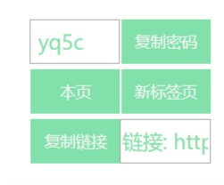

# Tampermonkey

日常写的油猴小脚本

## 贵族学院百度云链接获取者

自动获取百度云链接并展示到页面上（右下角），并快速复制密码

### 更新日志

2018-12-19：v0.37 改进正则以匹配更多种形式的链接  
2018-12-15：v0.36 添加正则对链接中的"_"的支持  
2018-11-24：v0.35 添加了一键复制链接密码按钮，方便粘贴到其他地方使用；由于复制方式的特殊性及能以有限，添加了一个文本框将其显示了出来  
2018-11-20：v0.32 正则表达式中加入"-"，以免匹配的链接不完整  
2018-11-19：v0.31 优化代码排版，变量命名；加入GitHub  
2018-11-19：v0.3 重装系统后丢失脚本，重写脚本并加入复制密码功能 

### 脚本不足

在遇到分卷压缩的资源时，由于源码中信息不全，即使能够显示链接密码，那么该资源也是有缺失的（明显特征是文件大小为2GB整，可在网页源码中看到信息不全），不建议下载

### 使用说明

+ 本脚本目标网站含有羞羞内容，此脚本仅供学习js之用，不建议使用者进行传播
+ 因为百度云链接在目标网站源码中可见，此脚本仅作为提高效率所用

### 接受捐助

万一谁给我捐点呢？

